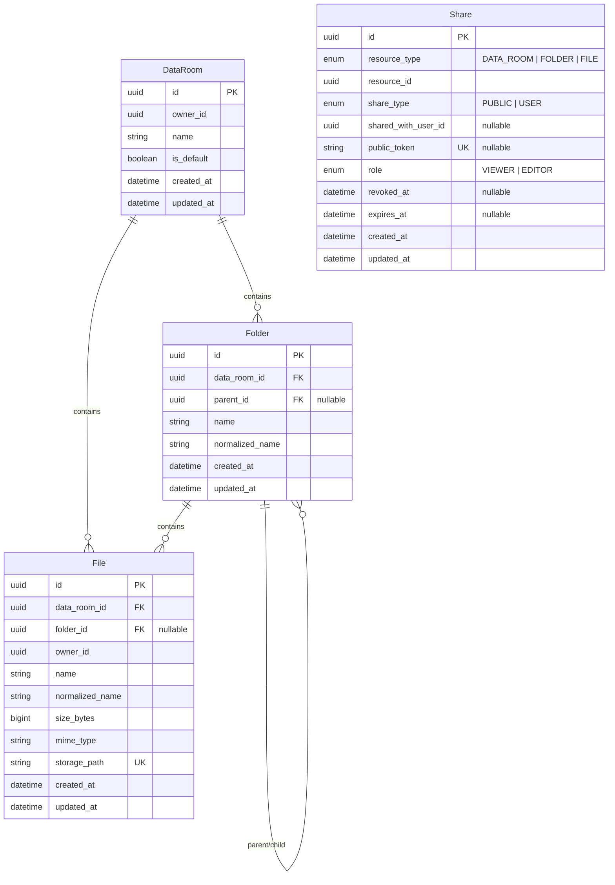

# Acme Data Room MVP

An enterprise-grade Virtual Data Room MVP built for Acme Corp.'s multi-billion dollar acquisition due diligence. Securely upload, organize, preview, share, and manage sensitive documents with strict access controls and real-time validation.

See [CODING_STANDARDS.md](CODING_STANDARDS.md) for project-wide standards on readable, secure, and maintainable code.

---

## 🚀 Deployed / Hosted URLs

- **Frontend**: [https://frontend-production-acme.vercel.app](https://frontend-production-acme.vercel.app) *(Deploy URL placeholder / configurable per environment)*
- **Backend API**: [https://backend-production-acme.up.railway.app](https://backend-production-acme.up.railway.app) *(Deploy URL placeholder / configurable per environment)*

---

## 📐 Design Decisions & Architecture

1. **Tech Stack & Frameworks**:
   - **Frontend**: Next.js (React / TypeScript / Tailwind CSS / Lucide Icons).
   - **Backend**: NestJS (TypeScript / RESTful API / Passport JWT / Class Validator).
   - **Database**: PostgreSQL with Prisma ORM.
   - **File Storage**: Supabase Storage (`data-room-pdfs` bucket for PDF files).
   - **Auth**: Supabase Auth / JWT authentication with secure session handling.

2. **Data Room Domain Model**:
   - Every user gets a single default root **Data Room** created dynamically upon first authentication (`ensureDefaultDataRoom`), establishing a clean top-level container for all folders and files.
   - **Folder Hierarchy**: Hierarchical recursive tree modeling using `parent_id` foreign key references with PostgreSQL recursive CTE queries (`WITH RECURSIVE`).
   - **File Resolution**: Automatic non-destructive name conflict resolution upon file upload (e.g. appending `(1)`, `(2)` suffixes while maintaining original file extension).
   - **Sharing Model**: Resource-agnostic `Share` entity supporting `DATA_ROOM`, `FOLDER`, or `FILE` target types across `PUBLIC` token link access and `USER` permissioned access with `VIEWER` or `EDITOR` granular roles.

3. **Storage & Database Integrity**:
   - Two-phase file operations: Files are stored in Supabase Storage with unique paths (`${userId}/${roomId}/${uuid}.pdf`), and database transaction cleanups ensure zero orphaned files in blob storage if DB record creation fails.

---

## 🗄️ Data Model / Entity Relationship Diagram (ERD)



---

## 📈 How It Scales

### 1. Computing Folder Subtree Size and Item Count
- **Current Approach**: Uses recursive Common Table Expressions (CTEs) in PostgreSQL (`WITH RECURSIVE subtree AS ...`) to traverse the folder hierarchy on demand and summarize total `size_bytes` and file/folder count across all nested children.
- **Scale Optimizations (Millions of items)**:
  - **Materialized Path / LTree**: Transition to PostgreSQL `ltree` extension or nested set model so subtree queries require a single prefix index lookup (`path ~ 'root.folder1.*'`) without recursive joins.
  - **Cached Rollups**: Maintain cached aggregate fields (`aggregate_size_bytes`, `child_file_count`, `child_folder_count`) on the `Folder` model, updated asynchronously via background queues or DB triggers during file write/delete operations.

### 2. Scaling to 100,000+ Files per Data Room
- **Database Indexing**: The current schema uses compound indexes designed for high concurrency and fast retrieval:
  - `@@index([dataRoomId, folderId, normalizedName])` for fast folder navigation & duplicate checking.
  - `@@index([folderId, createdAt, id])` for deterministic cursor-based pagination.
- **Pagination & Virtualization**:
  - Implement cursor-based / keyset pagination (`WHERE folder_id = :id AND (created_at, id) < (:last_created_at, :last_id) LIMIT 50`) on file list endpoints rather than offset pagination.
  - Render file lists on the frontend using windowing/virtualization libraries (`@tanstack/react-virtual` or `react-window`) to keep client DOM footprint lightweight regardless of folder size.

### 3. Extending Sharing to Per-User Roles (Viewer / Editor) without Remodeling
- The `Share` table is built with extensibility at its core:
  - Supports `role` column (`VIEWER` vs `EDITOR`) out of the box.
  - Decoupled from resource tables via `resource_type` (`DATA_ROOM`, `FOLDER`, `FILE`) and `resource_id`.
  - To grant user-level `EDITOR` access, insert a record into `Share` with `share_type = 'USER'`, `role = 'EDITOR'`, and `shared_with_user_id = :user_id`. Access middleware resolves permissions by checking `Share` hierarchy inheritance before performing write/edit actions.

---

## 🤖 Note on AI Assistance

AI assistance was utilized throughout development using **OpenAI Codex** and **Google Antigravity** as engineering accelerants for:
- Initial NestJS backend module scaffolding and Prisma ORM schema drafting.
- Formulating SQL CTE queries for recursive folder hierarchy operations and deletion cascading.
- Building dynamic Next.js/React components styled with Tailwind CSS for the file browser UI.
- Synthesizing technical architecture documentation, edge-case validation, and test strategies.

All AI-assisted code was reviewed, refactored to conform strictly to [`CODING_STANDARDS.md`](CODING_STANDARDS.md), and verified through automated and end-to-end runtime tests.

---

## 🛠️ Local Development & Setup

### Prerequisites
- Node.js 20+ and npm.
- Running PostgreSQL database instance and Supabase project.

### Setup Instructions

1. **Environment Configuration**:
   Copy `.env.example` to `.env` in the root directory:
   ```bash
   cp .env.example .env
   ```
   Provide valid credentials for `DATABASE_URL`, `SUPABASE_URL`, `SUPABASE_ANON_KEY`, `SUPABASE_SERVICE_ROLE_KEY`, `JWT_ISSUER`, `JWT_AUDIENCE`, and `JWKS_URI`.

2. **Backend Setup**:
   ```bash
   cd backend
   npm install
   npx prisma migrate dev
   npm run start:dev
   ```
   *Backend runs on `http://localhost:3001`.*

3. **Frontend Setup**:
   ```bash
   cd frontend
   npm install
   npm run dev
   ```
   *Frontend runs on `http://localhost:3000`.*

4. **Health Check Verification**:
   - Backend status: `http://localhost:3001/health`
   - Database & Storage status: `http://localhost:3001/health/dependencies` (returns `{"database":{"ok":true},"storage":{"ok":true}}`).

